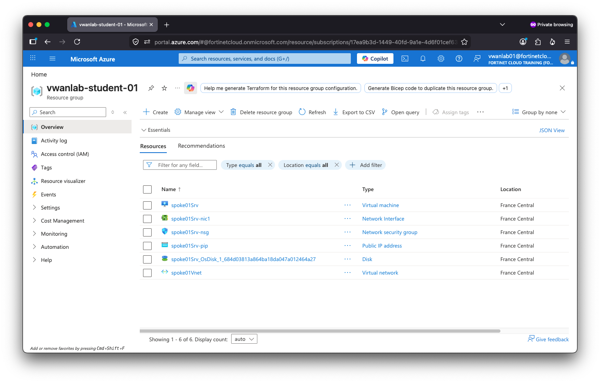

## Your lab environment

Each team has a set of dedicated resources and can access some shared systems as well. Please verify you can access all systems used in this workshop before proceeding.

## Azure Portal

Open the [Azure Portal](https://portal.azure.com) and log in using the credentials show below. If you are logged into your own Azure account make sure you switch to a different browser profile or use incognito mode.

Use the credentials below to access your Azure environment.

<EnvVar field="azure_username" label="Username" />
<EnvVar field="azure_password" label="Password" secret />
<EnvVar field="azure_tap" label="Temporary Access Pass" secret />

> **First login:** use the **Temporary Access Pass** shown above instead of the password. Select the option to stay logged in.

Once logged in go to **Resource Groups** and make sure you can see your resource group **<EnvVarInline field="rg_name" />**. Your view should be similar to this:

## FortiManager

In a new browser tab open the shared FortiManager UI 
<EnvVar label="FortiManager UI" field="fmg_ip" />

Log in using your username and password visible in My Environment.

> **Verify:** you should see only the ADOM named after your hub with one FortiGate in it.

## Branch FortiGate

That's the FortioGate at the edge of your regional on-site branch office. You can rach it via FortiManager or directly here:

<EnvVar field="branch_fgt_pip" label="Branch FortiGate PIP" />

Open https://<EnvVarInline field="branch_fgt_pip" /> in your browser. Accept the self-signed certificate warning. Log in with the same username and password as for FortiManager.

## Branch Windows desktop

Use RDP client installed in your OS (tsc on Windows/Windows App on MacOS) or any custom RDP client to connect directly to Windows desktop in your branch office. Keep in mind only one person from your team can be logged in at the same moment.

<EnvVar field="branch_win_pip" label="Winows desktop" />

